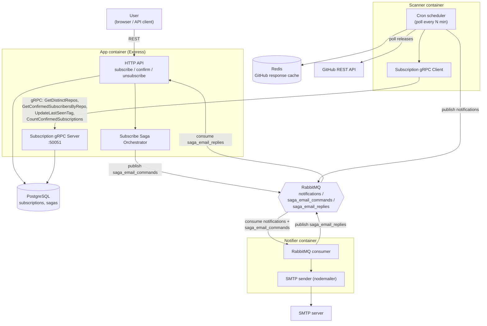

# Architecture (current)

Supersedes the monolithic view in [ADR-001](../adr/001-monolithic-architecture.md) and the diagrams in this folder
dated before the gRPC/saga split (`hw-9-saga`, `hw-10-rpc`). The system now runs as three deployable Node.js
processes sharing one codebase (`app`, `scanner`, `notifier`), coordinated via gRPC and RabbitMQ instead of
in-process calls.

## Container diagram

## Services

| Container  | Entry point              | Responsibility                                                                                                                                                          |
| ---------- | ------------------------ | ----------------------------------------------------------------------------------------------------------------------------------------------------------------------- |
| `app`      | `src/index.ts`           | REST API, owns Postgres, runs subscribe saga orchestrator, exposes gRPC server on `:50051`                                                                              |
| `scanner`  | `apps/scanner/index.ts`  | Polls GitHub on a cron schedule, reads/writes subscription state only via gRPC (no direct DB access), caches GitHub responses in Redis, publishes release notifications |
| `notifier` | `apps/notifier/index.ts` | Consumes RabbitMQ queues, sends email via SMTP, replies to sagas                                                                                                        |

## Why gRPC between scanner and app

Scanner needs subscription data (distinct repos, confirmed subscribers, last-seen-tag updates) but must not touch
Postgres directly — that would couple two independently-deployed processes to the same schema. gRPC gives a typed
contract (`src/proto/subscription/v1/subscription.proto`) owned by `app`.

## Why a saga for subscribe

`POST /api/subscribe` must insert the subscription row **and** send a confirmation email; the email send happens
in a different process (`notifier`) over an async queue, so it can't be a single transaction. `SubscribeSagaOrchestrator`
(`src/domains/saga`) tracks state (`STARTED` → `EMAIL_REQUESTED` → `COMPLETED` / `COMPENSATING` → `FAILED`) and, if
the notifier reports failure via `saga_email_replies`, compensates by deleting the subscription.

## Queues (`src/constants/queues.ts`)

| Queue                 | Producer   | Consumer   | Payload                               |
| --------------------- | ---------- | ---------- | ------------------------------------- |
| `notifications`       | `scanner`  | `notifier` | confirmation/release email requests   |
| `saga_email_commands` | `app`      | `notifier` | confirmation email request for a saga |
| `saga_email_replies`  | `notifier` | `app`      | success/failure result for a saga     |

## Layers & dependency rules

Inside a container, code is organized as a foundation layer plus feature-sliced domains
(`src/domains/{github,notification,saga,scanner,subscription}`), not a classic
controller/service/repository split across the whole app — each domain bundles its own
controller/service/repository/routes where it has them.

- **Foundation** (`config`, `constants`, `common`, `db`, `exceptions`, `middlewares`, `utilities`, `proto`) —
  no business logic, must never import from `domains`.
- **Domains** — each domain exposes a single public surface, `src/domains/<name>/index.ts`. Other domains
  (and `apps/*`) may only import `@domains/<name>` (the barrel), never a deep path like
  `@domains/<name>/some-internal-file`, and never a relative `../<name>/...` reaching across domain folders.
- **Domain-to-domain edges are an explicit whitelist**, not "anything goes":

    | From           | Allowed to depend on                     |
    | -------------- | ---------------------------------------- |
    | `subscription` | `github`, `saga`                         |
    | `saga`         | `subscription`, `notification`           |
    | `scanner`      | `github`, `notification`, `subscription` |
    | `github`       | — (leaf)                                 |
    | `notification` | — (leaf)                                 |

    `subscription` and `saga` depend on each other (`subscription.service` invokes the orchestrator on
    subscribe; the orchestrator depends on `ISubscriptionRepository` to compensate on failure). This is a
    known, accepted coupling — `saga` exists specifically to coordinate the subscribe flow — not an oversight.
    It's type-only in both directions (`import type`), so there's no runtime circular `require`.

These rules are enforced by `src/test/architecture/layered-architecture.test.ts`, which parses imports across
`src/**` and `apps/**` and fails if: a foundation file imports a domain, a cross-domain import bypasses the
barrel, or a domain-to-domain import isn't in the table above. Adding a new legitimate cross-domain dependency
means updating `ALLOWED_DOMAIN_EDGES` in that file on purpose, not silently passing.

## Observability (unchanged)

`app` exposes Prometheus metrics at `/metrics`; Prometheus scrapes it, Grafana visualizes. `scanner` and `notifier`
don't yet expose their own metrics endpoint. Container logs from all three are shipped via Filebeat to
Elasticsearch/Kibana.
